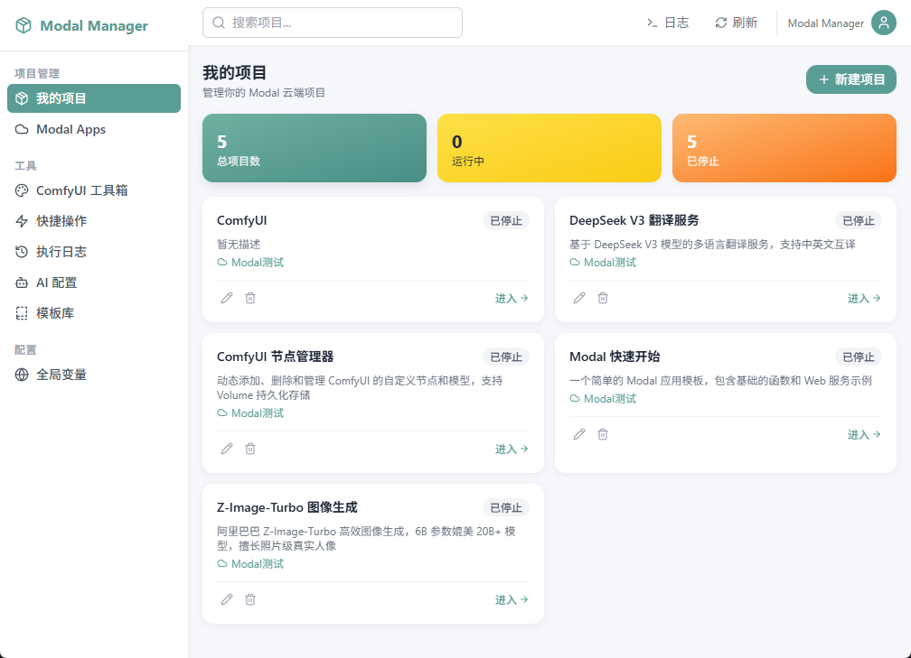
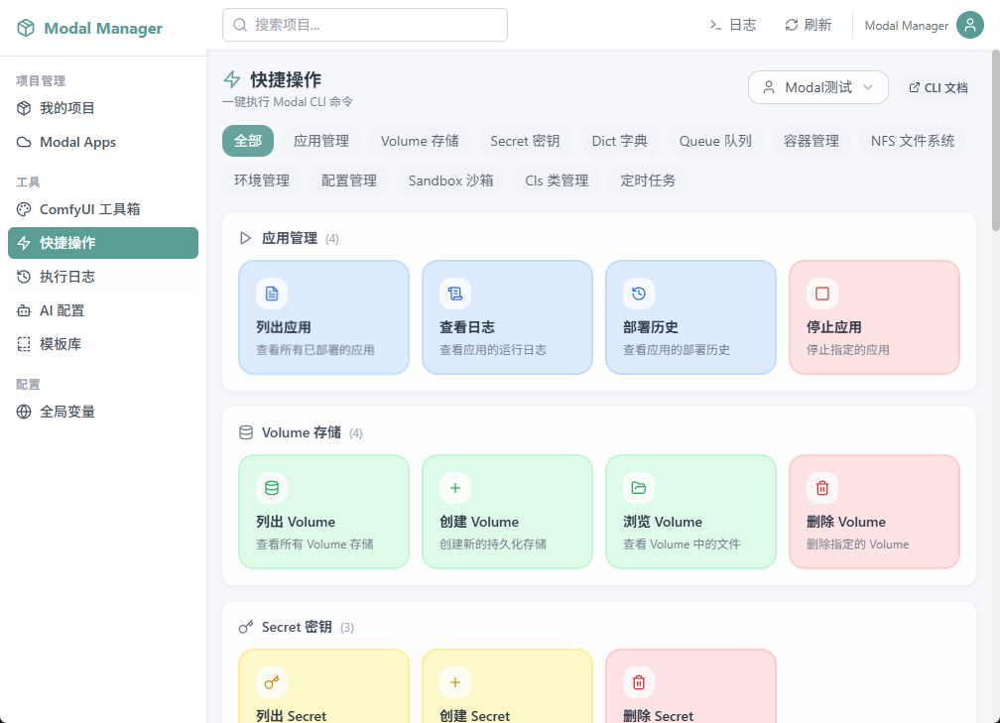
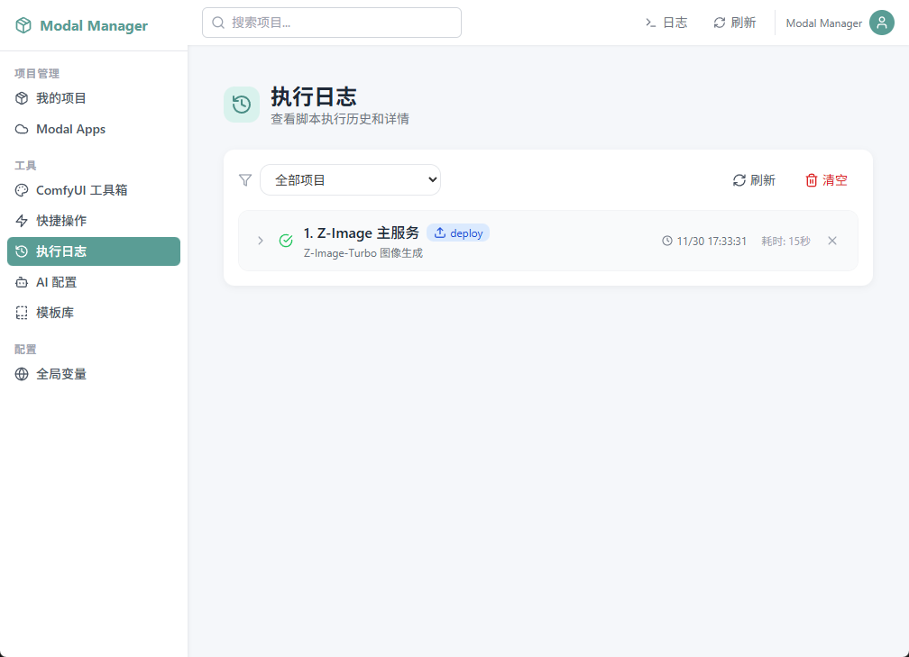
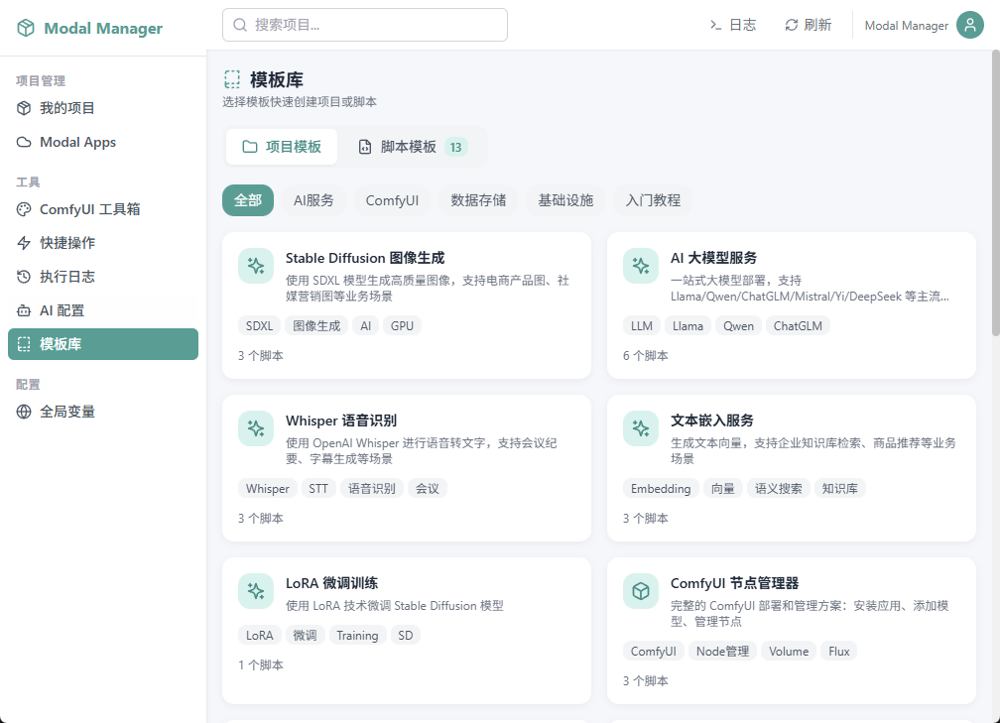

# Modal Manager

<div align="center">


**一站式 Modal 云端项目管理工具**

轻松管理你的 Modal 云端项目、应用和脚本

[](https://wails.io/)
[](https://react.dev/)
[](https://www.typescriptlang.org/)
[](https://tailwindcss.com/)

</div>

---

## ✨ 功能特性

- 🚀 **项目管理** - 创建、编辑、部署 Modal 云端项目
- ⚡ **快捷操作** - 一键执行常用 Modal CLI 命令
- 📋 **执行日志** - 查看脚本执行历史和详情
- 🎨 **模板库** - 丰富的项目和脚本模板，快速上手
- 🤖 **AI 配置** - 集成 AI 服务配置
- 🔧 **ComfyUI 工具箱** - 专为 ComfyUI 设计的管理工具
- 🌐 **全局变量** - 统一管理环境变量和配置

---

## 📸 界面预览

### 我的项目

管理你的 Modal 云端项目，支持项目的创建、编辑、部署和停止。



### 快捷操作

一键执行 Modal CLI 命令，包括应用管理、Volume 存储、Secret 密钥等常用操作。



### 执行日志

查看脚本执行历史和详情，支持按项目筛选和日志清空。



### 模板库

选择模板快速创建项目或脚本，涵盖 AI 服务、ComfyUI、数据存储等多个领域。



---

## 🛠️ 技术栈

| 层级 | 技术 |
|------|------|
| **桌面框架** | [Wails v2](https://wails.io/) |
| **后端** | [Go](https://golang.org/) |
| **前端** | [React 18](https://react.dev/) + [TypeScript](https://www.typescriptlang.org/) |
| **样式** | [Tailwind CSS](https://tailwindcss.com/) |
| **构建工具** | [Vite](https://vitejs.dev/) |
| **云平台** | [Modal](https://modal.com/) |

---

## 📦 安装与运行

### 环境要求

- Go 1.21+
- Node.js 18+
- Wails CLI v2

### 安装 Wails

```bash
go install github.com/wailsapp/wails/v2/cmd/wails@latest
```

### 开发模式

```bash
# 安装前端依赖
cd frontend && npm install && cd ..

# 启动开发服务器
wails dev
```

### 构建发布

```bash
# Windows
wails build

# 生成的可执行文件在 build/bin/ 目录
```

---

## 📁 项目结构

```
modal-manager/
├── app.go                 # Go 后端主逻辑
├── main.go                # 程序入口
├── wails.json             # Wails 配置
├── frontend/              # 前端代码
│   ├── src/
│   │   ├── components/    # React 组件
│   │   ├── pages/         # 页面组件
│   │   ├── context/       # React Context
│   │   ├── data/          # 静态数据
│   │   └── types/         # TypeScript 类型定义
│   └── ...
├── data/                  # 运行时数据
│   ├── projects/          # 项目脚本文件
│   └── ...
└── build/                 # 构建输出
```

---

## 🚀 快速开始

1. **创建项目** - 在"我的项目"页面点击"新建项目"
2. **编写脚本** - 使用内置脚本编辑器编写 Modal Python 脚本
3. **一键部署** - 点击"部署"按钮将脚本部署到 Modal 云端
4. **查看日志** - 在"执行日志"页面查看部署和运行日志

---

## 📄 许可证

MIT License

---

## 👤 作者

- **作者**: 20043376
- **邮箱**: zengzhigang@lppz.com

---

<div align="center">

**[⬆ 返回顶部](#modal-manager)**

</div>

